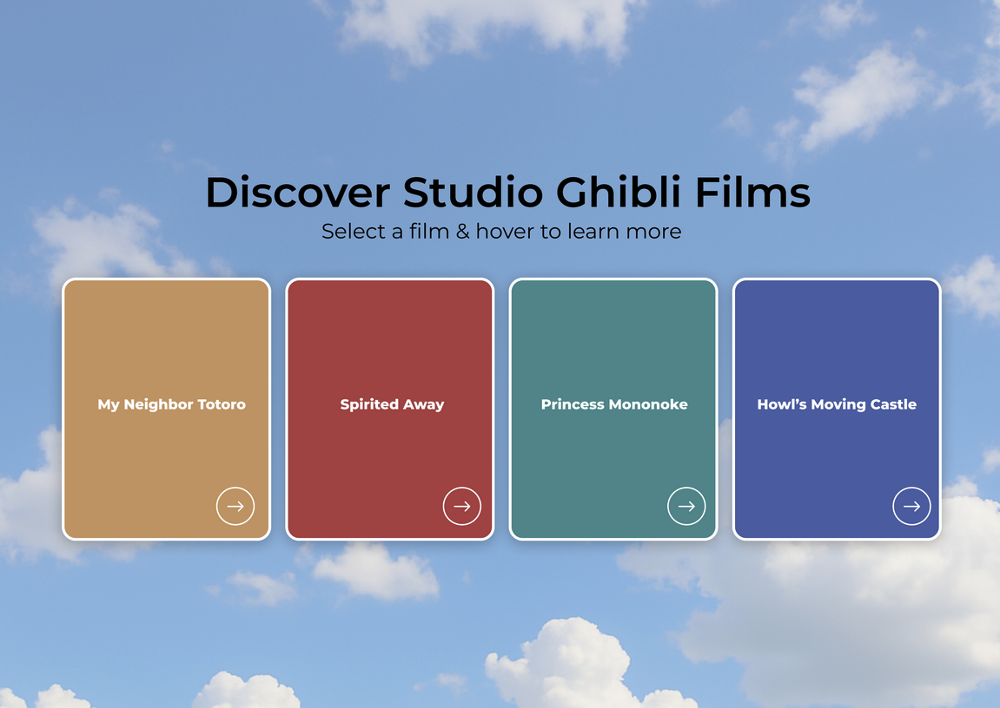
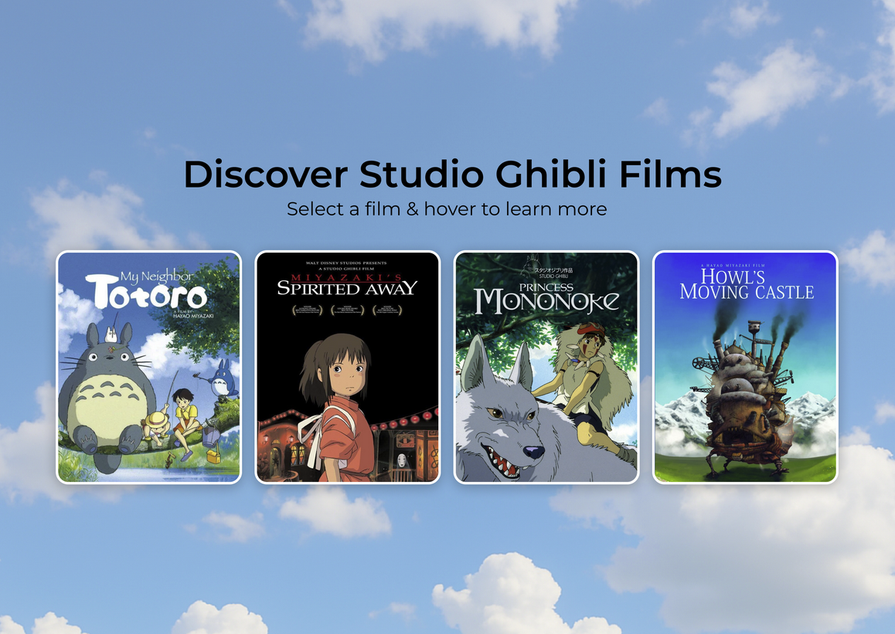
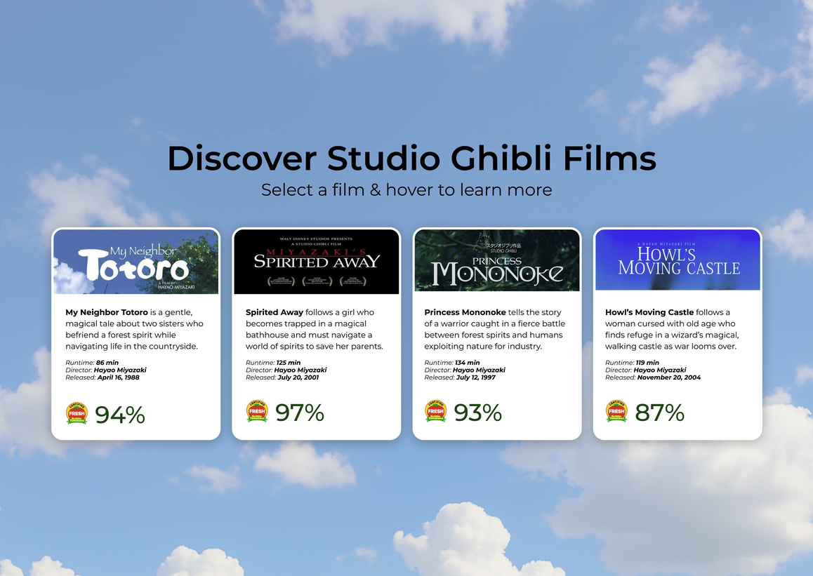

# Product Requirements Document

## Studio Ghibli Film Cards Application

### 1. Introduction/Overview

The Studio Ghibli Film Cards application is an interactive React web application designed to create an engaging way for users to browse and discover Studio Ghibli films. The application features four prominent film selection buttons that, when clicked, fetch and display detailed film information in beautifully animated flipable cards. This creates an immersive experience that combines the technical demonstration of GraphQL integration with an intuitive, visually appealing interface.

**Design Reference:** This application follows the visual design specifications provided in the Zeplin mockups located in the `/designs` directory, which illustrate the different card states (unloaded, loaded, and hovered).

**Problem Solved:** Users need an engaging, interactive way to explore and learn about Studio Ghibli films with smooth animations and responsive design that works across all devices.

### 2. Goals

1. **Primary Goal:** Create an engaging and intuitive way for users to browse and discover Studio Ghibli films
2. **Technical Goal:** Demonstrate proper GraphQL integration with type-safe operations using code generation
3. **UX Goal:** Deliver smooth, responsive interactions that work seamlessly on both desktop and mobile devices
4. **Visual Goal:** Create visually appealing flipable cards with smooth animations

### 3. User Stories

**As a film enthusiast**, I want to click on film buttons to see detailed information about Studio Ghibli movies so that I can discover and learn about these classic films.

**As a mobile user**, I want to tap on cards to flip them and reveal film details so that I can interact with the content using touch gestures.

**As a desktop user**, I want to hover over cards to see them flip and reveal additional information so that I can quickly preview film details.

**As a user with a small screen**, I want the application to reorganize into a single column layout so that I can comfortably view all content on my device.

### 4. Functional Requirements

1. **Page Layout and Headers**

- The page must display a light blue sky background
- The page must include a primary header: "Discover Studio Ghibli Films"
- The page must include a subheader: "Select a film and hover to learn more."

2. **Film Selection Interface**

- The system must display four film cards with solid colored backgrounds:
  - My Neighbor Totoro (#d79a68 background)
  - Spirited Away (#c24646 background)
  - Princess Mononoke (#279094 background)
  - Howl's Moving Castle (#3e6cac background)
- Each card must display the film title in white text, centered
- Each card must have a right arrow button in the bottom right corner
- The entire card must be clickable to trigger a GraphQL query for film data

2. **Loading States**

- When a card is clicked, the right arrow button in the bottom right corner must display a loading spinner
- The card's colored background, title, and overall appearance must remain unchanged during loading
- Loading states must persist until the film data is successfully fetched
- Only the arrow button should change to show loading state

3. **GraphQL Integration**

   - The system must use GraphQL Code Generator to create properly typed hooks
   - The system must use `useLazyQuery` for on-demand film data fetching
   - All GraphQL operations must be fully typed with TypeScript

4. **Card Display System**

   - When film data is fetched, the system must replace placeholder content with film cards
   - Each card must display the movie poster/image and movie title on the front

5. **Interactive Card Functionality**

   - Cards must flip to reveal additional information on hover (desktop) or tap (mobile)
   - The back of each card must display: movie banner, description, director, release date, runtime, and Rotten Tomatoes score
   - Cards must flip back when hover ends (desktop) or when tapped again (mobile)

6. **Mobile Responsiveness**
   - The application must reorganize cards into a single column layout on mobile devices
   - The application must function properly and look good at screen widths down to 320px
   - Touch interactions must work smoothly for card flipping on mobile devices

### 5. Non-Goals (Out of Scope)

- Film search functionality
- User favorites or bookmarks system
- Film rating or review system
- Multiple film selection
- Film trailers or additional media content
- User authentication or personalization
- Data persistence or caching
- Advanced filtering or sorting
- Social sharing features

### 6. Design Considerations

**Design Mockups:**

The application follows a card-based design pattern as illustrated in the Zeplin design mockups. Each mockup shows all four cards in different states:

1. **Unloaded Card State**: All four cards in their initial unloaded state, showing film buttons in a clean, minimal layout. Each card features:
   - Solid colored backgrounds: My Neighbor Totoro (orange), Spirited Away (red), Princess Mononoke (green), Howl's Moving Castle (purple)
   - White text titles centered in each card
   - Right arrow button in the bottom right corner of each card
   - The entire card is clickable to trigger film data fetching

2. **Loaded Card State**: All four cards in their loaded state, displaying movie posters and titles after data has been fetched

3. **Hovered Card State**: All four cards in their hovered state, showing the flipped cards with detailed film information revealed

**Note:** Individual cards can be in different states simultaneously (e.g., some cards loaded while others remain unloaded, or some cards hovered while others are not).

**Layout:**

- Light blue sky background with clouds as the page background image
- Primary header: "Discover Studio Ghibli Films"
- Subheader: "Select a film and hover to learn more."
- Four film buttons prominently displayed in a clean, minimal design
- Cards should use a consistent, modern design language matching the Zeplin mockups
- Smooth CSS transitions for all animations (60fps target)

**Visual Design:**

- Use Material-UI components where appropriate
- Ensure proper contrast and accessibility
- Implement smooth card-flip animations with CSS transforms
- Follow the visual style and spacing shown in the design mockups

**Responsive Behavior:**

- Desktop: Hover interactions for card flipping
- Mobile: Tap interactions with clear visual feedback
- Single column layout for screens < 768px width

### 7. Technical Considerations

**Frontend Stack:**

- React 18+ with TypeScript
- Apollo Client for GraphQL integration
- Material-UI for consistent component styling
- GraphQL Code Generator for type-safe operations

**Backend Integration:**

- Utilize existing Apollo Server setup
- Connect to Studio Ghibli API via existing HttpService
- Implement proper error handling for API failures

**Performance:**

- Lazy load film data only when requested
- Optimize images for web delivery
- Ensure smooth 60fps animations

### 8. Success Metrics

**Primary Success Criteria:**

- All four films load and display correctly when buttons are clicked
- Smooth animations and interactions work flawlessly on mobile devices
- GraphQL integration is properly typed and free of runtime errors
- Application functions properly and looks good at screen widths down to 320px

**Secondary Success Criteria:**

- Cards flip smoothly with proper animations
- Loading states provide clear user feedback
- Error handling gracefully manages API failures
- Code is clean, well-structured, and follows best practices

### 9. Open Questions

1. Should we implement any specific error messaging for failed API calls?
2. Are there any specific animation timing preferences for card flips?
3. Should we add any loading skeleton states while data is being fetched?

---

**Target Films for Implementation:**

| Film Title              | API ID                                 |
| ----------------------- | -------------------------------------- |
| Porco Rosso             | `ebbb6b7c-945c-41ee-a792-de0e43191bd8` |
| Kiki's Delivery Service | `ea660b10-85c4-4ae3-8a5f-41cea3648e3e` |
| Howl's Moving Castle    | `cd3d059c-09f4-4ff3-8d63-bc765a5184fa` |
| My Neighbor Totoro      | `58611129-2dbc-4a81-a72f-77ddfc1b1b49` |

---

This PRD provides clear, actionable requirements that a junior developer can understand and implement, focusing specifically on the engaging film discovery experience while maintaining technical excellence in GraphQL integration and responsive design.
